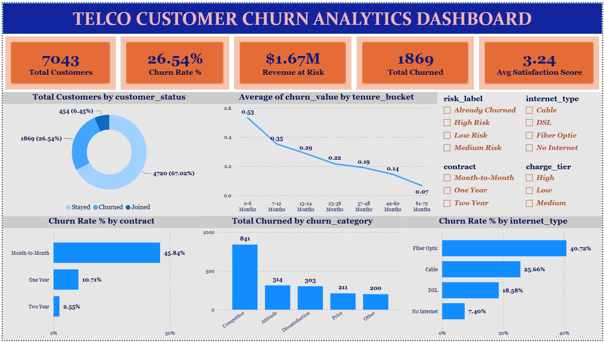
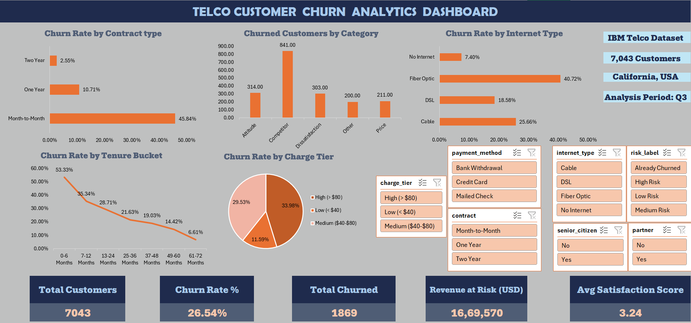

# 📊 Telco Customer Churn Analytics

A full-stack end-to-end data analytics project analyzing customer churn for a California-based telecom company using 4 industry-standard tools independently on the same dataset.

---

## 🧠 Business Problem

Customer churn is one of the most critical challenges in the telecom industry. With an industry average churn rate of 15-20%, this project analyzes IBM's Telco Customer Churn dataset to identify why customers leave, which segments are most at risk, and what the revenue impact is.

**Key Business Questions:**
- What is the overall churn rate and how does it compare to industry average?
- Which contract types, internet services, and demographics drive churn?
- What are the top reasons customers leave?
- How much revenue is at risk from churning customers?
- Which customers are high-value and high-risk simultaneously?

---

## 🛠️ Tech Stack


---

## 📁 Dataset

**Source:** IBM Telco Customer Churn Dataset  
**Size:** 7,043 customers, California USA  
**Files:** 6 raw CSV files

| File | Columns | Description |
|---|---|---|
| Telco_customer_churn_demographics.csv | 9 | Age, gender, dependents |
| Telco_customer_churn_location.csv | 10 | City, zip, coordinates |
| Telco_customer_churn_services.csv | 31 | Contract, internet, charges |
| Telco_customer_churn_status.csv | 12 | Churn value, score, reason |
| Telco_customer_churn_population.csv | 3 | Zip code populations |
| CustomerChurn.csv | 21 | Condensed version with Partner column |

---

## 🏗️ Project Architecture

```
Raw CSV Files (6 files, 7043 customers)
         │
         ├──► Python (Google Colab)
         │    └── EDA, cleaning, feature engineering, visualizations
         │
         ├──► SQL Server (ChurnDB)
         │    └── Star schema, KPI queries, views, stored procedure
         │
         ├──► Microsoft Excel
         │    └── Power Query cleaning, pivot tables, dashboard
         │
         └──► Power BI Desktop
              └── Power Query, DAX measures, interactive dashboard
```

---

## 🔍 Key Findings

| Finding | Value |
|---|---|
| Overall Churn Rate | 26.54% (industry avg: 15-20%) |
| Month-to-Month Churn | 45.84% |
| Two Year Contract Churn | 2.55% |
| Fiber Optic Churn | 40.72% |
| Top Churn Reason | Competitor had better devices (313 customers) |
| Competitor Category Share | 45% of all churn |
| 0-6 Month Tenure Churn | 53.33% |
| Senior Citizen Churn | 41.68% |
| Customers with Partner Churn | 19.66% |
| No Partner Churn | 32.96% |
| Churned Avg Monthly Charge | $74.44 vs $61.27 stayed |
| Churned Satisfaction Score | 1.74 vs 3.79 stayed |
| Total Revenue | $21,371,131 |
| Revenue at Risk | $1,669,570 |
| San Diego Churn Rate | 64.91% — highest city |

---

## 📸 Dashboard Screenshots

### Power BI Dashboard


### Excel Dashboard


---

## 📂 Folder Structure

```
telco-churn-analytics/
├── data/
│   ├── raw/                         # 6 original CSV files
│   └── cleaned_churn_data.csv       # Python cleaned output
├── excel/
│   └── churn_dashboard.xlsx         # Excel analysis + dashboard
├── powerbi/
│   └── ChurnDashboard.pbix          # Power BI dashboard
├── python/
│   ├── 01_EDA_Churn_Analysis.ipynb  # EDA + cleaning + NumPy
│   └── load_to_sql.py               # SQL Server data loader
├── screenshots/
│   ├── churn_by_contract.png        # EDA
│   ├── churn_by_internet.png        # EDA
│   ├── churn_by_tenure.png          # EDA
│   ├── churn_distribution.png       # EDA
│   ├── churn_reasons.png            # EDA
│   ├── excel_dashboard.png
│   └── powerbi_dashboard.png
├── sql/
│   ├── 01_schema.sql                # Star schema creation
│   ├── 02_kpi_queries.sql           # 17 KPI queries
│   └── 03_views.sql                 # 11 analytical views
├── .gitignore
├── README.md
└── requirements.txt
```

---

## ⚙️ Setup Instructions

### Python (Google Colab)
1. Upload all 6 raw CSV files to Google Drive
2. Open `python/01_EDA_Churn_Analysis.ipynb` in Google Colab
3. Run all cells in order

### SQL Server
1. Install SQL Server Developer Edition and SSMS
2. Install ODBC Driver 18 for SQL Server
3. Run `python/load_to_sql.py` to create ChurnDB and load staging tables
4. Run `sql/01_schema.sql` to create star schema
5. Run `sql/02_kpi_queries.sql` for KPI analysis
6. Run `sql/03_views.sql` to create analytical views

### Excel
1. Open `excel/churn_dashboard.xlsx`
2. If prompted, enable content and refresh Power Query connections
3. Navigate to Dashboard sheet

### Power BI
1. Open `powerbi/ChurnDashboard.pbix`
2. Update SQL Server connection string to your local instance
3. Click Refresh to reload data

---

## 📦 Requirements

See `requirements.txt` for Python dependencies.

Key packages:
- pandas
- numpy
- matplotlib
- seaborn
- sqlalchemy
- pyodbc

---

## 👩‍💻 Author

**Bhoomi Jindal**  
Data Analytics Intern  
GitHub: [github.com/BhoomiJindal](https://github.com/BhoomiJindal)